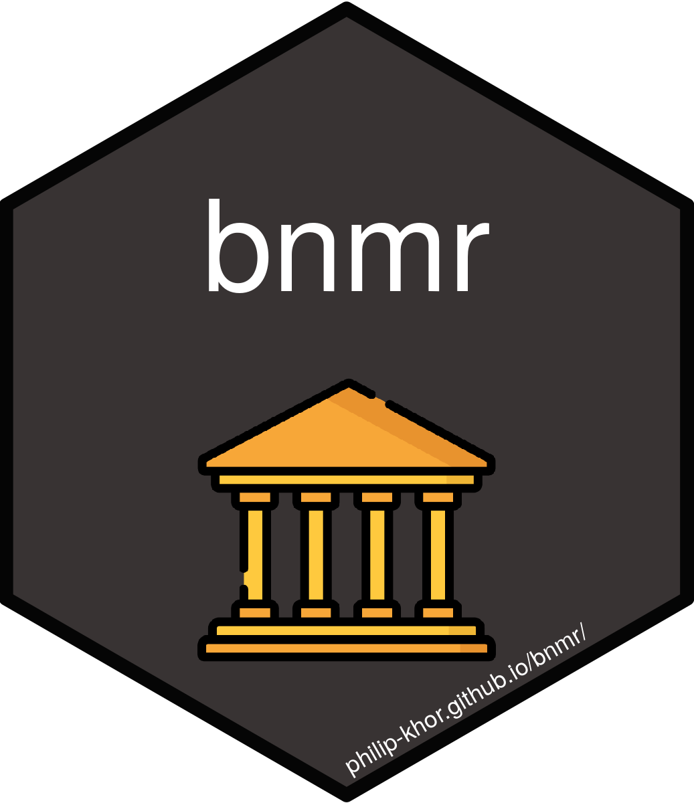

<!-- README.md is generated from README.Rmd. Please edit that file -->

```{r setup, include = FALSE}
knitr::opts_chunk$set(
  collapse = TRUE,
  comment = "#>",
  fig.path = "man/figures/README-",
  out.width = "100%"
)
```

# bnmr

</img>

<!-- badges: start -->
[](https://codecov.io/gh/philip-khor/bnmr?branch=master)
[](https://github.com/philip-khor/bnmr/actions)
[](https://github.com/philip-khor/bnmr/actions/workflows/R-CMD-check.yaml)
<!-- badges: end -->
  
The goal of **bnmr** is to provide a set of convenient wrapper functions for the Central Bank of Malaysia's API. 


## Installation


To install **bnmr**, run the following code (requires remotes):

```{r, eval = FALSE}
# install.packages("remotes")
remotes::install_github("philip-khor/bnmr")
```

## Example

This is a basic example which shows you how to solve a common problem:

```{r, message = FALSE}
library(bnmr)
get_base_rate()
```

## License 

This project is licensed under the terms of the MIT license.
