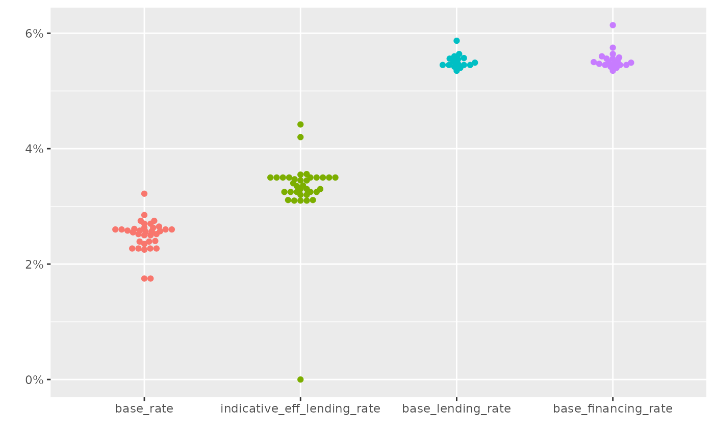
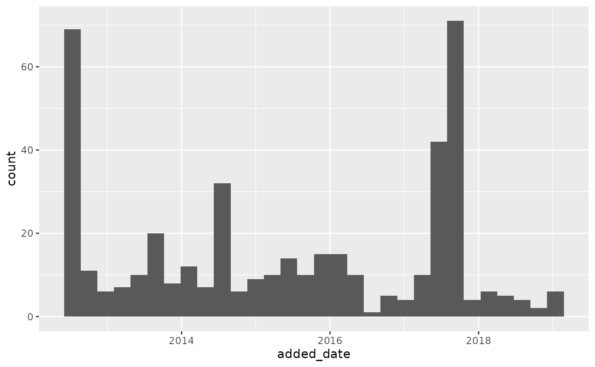

# Using bnmr

## Base rate

``` r

library(bnmr)
#> BNM Open API
#> Visit https://apikijangportal.bnm.gov.my/disclaimer to view disclaimers.
#> v1
library(ggplot2)
library(tidyr)
library(dplyr)
#> 
#> Attaching package: 'dplyr'
#> The following objects are masked from 'package:stats':
#> 
#>     filter, lag
#> The following objects are masked from 'package:base':
#> 
#>     intersect, setdiff, setequal, union
library(ggbeeswarm)
library(lubridate)
#> 
#> Attaching package: 'lubridate'
#> The following objects are masked from 'package:base':
#> 
#>     date, intersect, setdiff, union
```

``` r

get_base_rate() |> 
  gather(key, val, -bank_code, -bank_name) |> 
  mutate(key = factor(key, 
                      levels = c("base_rate", 
                                 "indicative_eff_lending_rate", 
                                 "base_lending_rate", 
                                 "base_financing_rate"))) |> 
  ggplot() + 
    geom_beeswarm(aes(x = key, y = val / 100, color = key)) + 
    scale_color_discrete(guide = FALSE) + 
    scale_y_continuous(labels = scales::percent) + 
    labs(x = "", y = "")
#> Warning: The `guide` argument in `scale_*()` cannot be `FALSE`. This was deprecated in
#> ggplot2 3.3.4.
#> ℹ Please use "none" instead.
#> This warning is displayed once per session.
#> Call `lifecycle::last_lifecycle_warnings()` to see where this warning was
#> generated.
#> Warning: Removed 35 rows containing missing values or values outside the scale range
#> (`geom_point()`).
```



### Consumer alerts

``` r

# TODO: make sure output from added_date column is date
get_consumer_alert() |> 
  mutate(added_date = ymd(added_date)) |> 
  ggplot(aes(x = added_date)) + geom_histogram()
#> `stat_bin()` using `bins = 30`. Pick better value `binwidth`.
```


